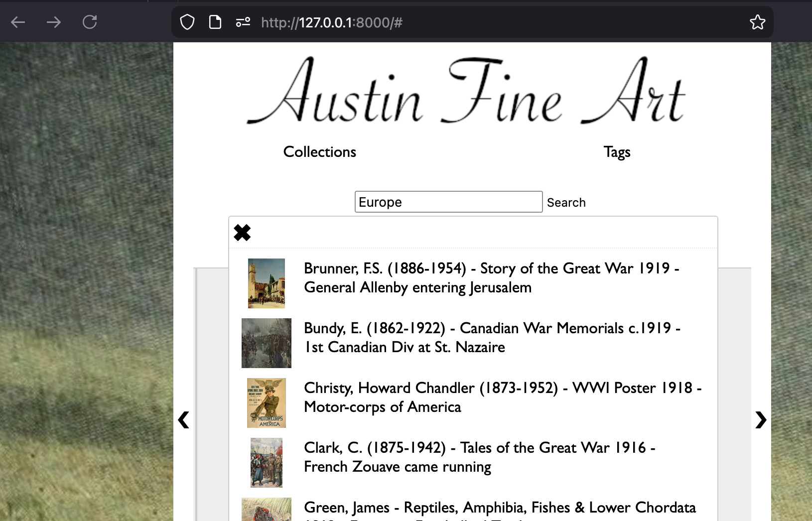
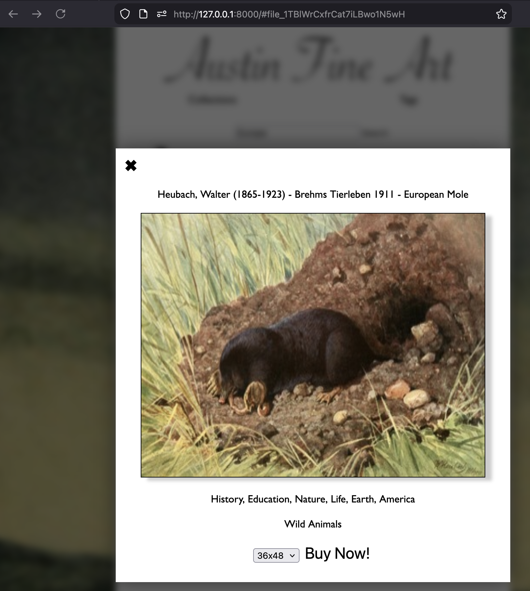

# bulk.art

Small example art gallery using sql.js and a SQLite database pushed into the browser.

```
git clone https://github.com/brandonprry/bulk.art.git
cd bulk.art
```

While I will use the python HTTP module here to start an HTTP server, there is ZERO reliance on python itself, we just need an HTTP server. You can use any HTTP server you want.

```
python -m http.server 9001
```




